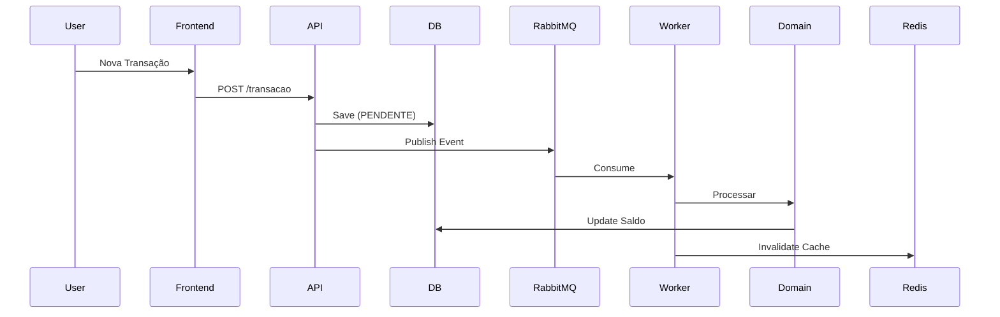

# Sequence – Criar Transação

```mermaid
sequenceDiagram
User->>Frontend: Nova Transação
Frontend->>API: POST /transacao
API->>DB: Save (PENDENTE)
API->>RabbitMQ: Publish Event
RabbitMQ->>Worker: Consume
Worker->>Domain: Processar
Domain->>DB: Update Saldo
Worker->>Redis: Invalidate Cache
```